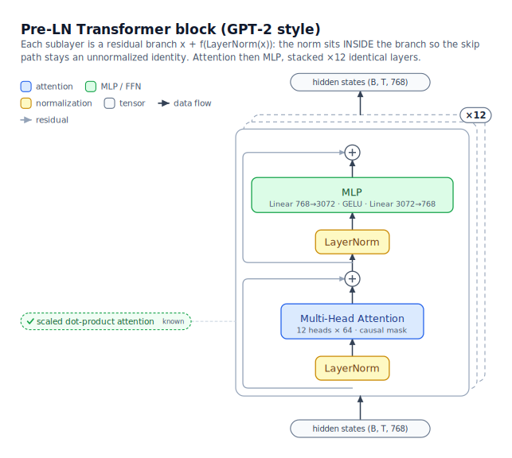
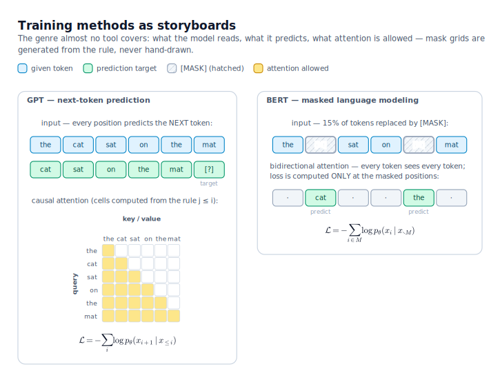

# archscope

**Publication-quality, hierarchical figures of model architectures and training methods —
built for the workflow: *an agent reads the code, then draws the figures*.**

No auto-layout, no op-soup. A figure is a small Python script; the library supplies
NeurIPS-style components, measurement-based layout, perpendicular edge routing, and
vector math — you (or your coding agent) supply the understanding.

<p align="center"></p>

```python
col = VStack([
    IOLabel("y  (B, T, 768)", id="out"),
    OpDot("+", id="add"),
    Block("MLP", kind="ffn", sub="Linear 768→3072 · GELU · Linear 3072→768",
          src="model.py:42", id="mlp"),
    Block("LayerNorm", kind="norm", id="ln"),
    IOLabel("x  (B, T, 768)", id="inp"),
], gap=22)
d.place(col, 200, 60)
d.chain(["inp", "ln", "mlp", "add", "out"], labels=[None, "(B, T, 768)", None, None])
```

## What it draws

1. **Block anatomy** — what a tensor passes through (attention / FFN / RMSNorm / VAE / …),
   decomposed level by level (system → model → block → sublayer), every claim annotated
   with a `file:line` source pointer.
2. **Tensor flow** — shape-annotated dataflow at every level of the hierarchy.
3. **Training methods** — the genre almost no tool covers: objectives as storyboards
   (token rows, attention-mask grids, noise schedules, loss formulas as outlined
   vector math).

Concepts the reader already knows (*"I know what attention is"*) collapse into a
✓-chip instead of being expanded — decomposition depth is a per-reader choice.

<p align="center"></p>

## Install & run

```bash
pip install -e .            # only dependency: matplotlib
brew install resvg          # optional: PNG export (SVG always works)

python examples/quickstart.py          # ~40-line API tour
python examples/transformer_block.py   # card-stacked ×12 layer, residual rails
python examples/training_methods.py    # GPT next-token vs BERT masked-LM
```

Outputs land in `out/` as self-contained SVG (fonts as text, math as outlined paths —
survives every converter) plus 4× PNG.

## Case study: LingBot-VA

`examples/lingbot_va/` + [`out/lingbot_va/`](out/lingbot_va/README.md) — an 8-figure
set for Ant Group's LingBot-VA video-action world model, drawn by an agent that read
the code and the paper. It surfaced a real finding: **the paper describes a dual-stream
MoT (video d=3072 / action d=768), while the released code ships a single shared-weight
stream routed purely by the attention mask** — including the fossil evidence in the
config lists.

<p align="center"></p>

## Design rules the library enforces

- **Edges meet boxes perpendicular** to the side they touch, with entry/exit stubs
  (the default router guarantees it; raw-point endpoints take `a_side`/`b_side`).
- **Repeated blocks are card stacks** (`RepeatStack`): solid front card, dashed ghost
  outlines behind; edges attach to the stack envelope and never cross the ghosts.
- **Computed truth**: mask grids / schedules are generated by re-implementing the
  model's actual rules inside the figure script, never hand-transcribed
  (see `examples/training_methods.py` and the LingBot fig 5).
- **Semantic palette**: one pastel family per component kind (attention, FFN, norm,
  conditioning, VAE, …), auto-legend; modality stripes for multi-modal models.
- Glyph-safe text (no .LastResort tofu), DejaVu-metric measurement so boxes never
  underflow, KaTeX-free math via matplotlib mathtext → SVG paths.

## Authoring rules (for agents and humans)

- **Verify before drawing**: every node/edge fact comes from code you read
  (annotate `file:line`) or the paper (annotate §/page). Paper-vs-code conflicts are
  *content*, not noise — draw both and say so.
- Read the rendered output before calling a figure done. Overlaps are bugs.
- A complex model is several figures linked by `→ Fig N` pointers, not one mural.

## Status & roadmap

Early but used in anger (the two figure sets in this repo are real work products).
Planned: parameterized training-method templates (diffusion/flow-matching panels),
an optional torch tracer for shape cross-checks, a JSON spec layer once the grammar
stabilizes, PDF export. Issues and PRs welcome.

## License

MIT. Built with [Claude Code](https://claude.com/claude-code) driving the library —
which is also its intended user.
