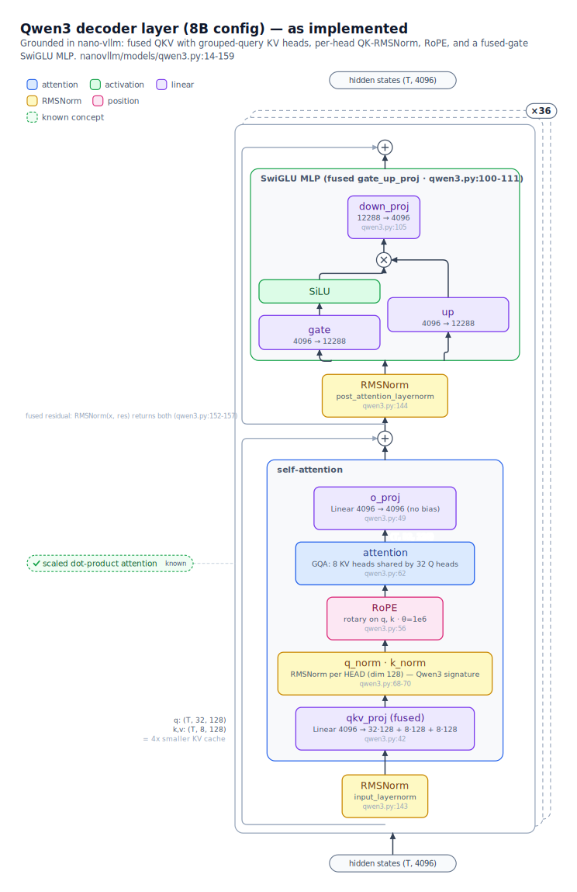
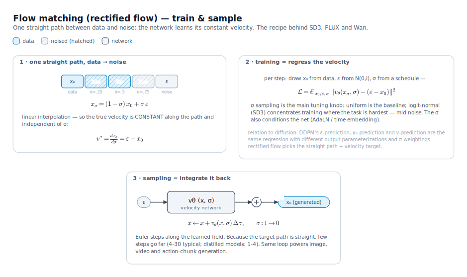

# archscope

[](LICENSE)
[](pyproject.toml)

**Publication-quality, hierarchical figures of model architectures and training methods —
built for the workflow: *an agent reads the code, then draws the figures*.**

No auto-layout, no op-soup. A figure is a small Python script; the library supplies
NeurIPS-style components, measurement-based layout, perpendicular edge routing, and
vector math — you (or your coding agent) supply the understanding.

<p align="center"></p>

```python
# one call: stack in dataflow order, auto-id from labels, auto-connect with arrows
d.flow([
    IOLabel("x  (B, T, 768)"),
    Block("LayerNorm", kind="norm"),
    Block("MLP", kind="ffn", sub="768 → 3072 · GELU · 3072 → 768", src="model.py:42"),
    OpDot("+", id="add"),
    IOLabel("y  (B, T, 768)"),
], dir="up", x=240, y=120)

d.auto_legend(160, 86)        # legend built from what was used
assert not d.check()          # structured overlap report — no need to open the PNG
```

No per-box coordinates, no manual `chain`, no hand-written legend. Place a second
column relative to the first with `d.place(el, right_of="enc", gap=80)`.

## What it draws

1. **Block anatomy** — what a tensor passes through (attention / FFN / RMSNorm / VAE / …),
   decomposed level by level (system → model → block → sublayer), every claim annotated
   with a `file:line` source pointer.
2. **Tensor flow** — shape-annotated dataflow at every level of the hierarchy.
3. **Training methods** — the genre almost no tool covers: objectives as storyboards
   (token rows, attention-mask grids, noise schedules, loss formulas as outlined
   vector math).

Concepts the reader already knows (*"I know what attention is"*) collapse into a
✓-chip instead of being expanded — decomposition depth is a per-reader choice.

## Install & run

```bash
pip install -e .            # only dependency: matplotlib
brew install resvg          # optional: PNG export (SVG always works)

python examples/quickstart.py          # ~40-line API tour
```

Outputs land in `out/` as self-contained SVG (fonts as text, math as outlined paths —
survives every converter) plus 4× PNG. Full index: [`examples/`](examples/README.md).

## Gallery

<table>
<tr>
<td width="50%" valign="top">
<a href="examples/qwen3_block.py"></a>
<sub><b>Qwen3 decoder layer, as implemented</b> — fused GQA shapes, per-head QK-RMSNorm,
two-branch SwiGLU; every box cites <code>nano-vllm</code> <code>file:line</code>.</sub>
</td>
<td width="50%" valign="top">
<a href="examples/training_methods.py"></a>
<sub><b>Training objectives as storyboards</b> — GPT next-token vs BERT masked-LM; the
attention-mask grids are computed from the rule (<code>j ≤ i</code>), never hand-drawn.</sub>
</td>
</tr>
<tr>
<td width="50%" valign="top">
<a href="examples/flow_matching.py"></a>
<sub><b>Flow matching (rectified flow)</b> — the SD3/FLUX/Wan objective: one straight path,
regress its velocity, integrate it back.</sub>
</td>
<td width="50%" valign="top">
<a href="examples/lingbot_va/"></a>
<sub><b>Case study: LingBot-VA</b> — 8 figures from an agent reading real code; per-token
AdaLN block shown here. Full gallery: <a href="out/lingbot_va/README.md">out/lingbot_va</a>.</sub>
</td>
</tr>
</table>

## Case study: LingBot-VA

`examples/lingbot_va/` + [`out/lingbot_va/`](out/lingbot_va/README.md) — an 8-figure
set for Ant Group's LingBot-VA video-action world model, drawn by an agent that read
the code and the paper. It surfaced a real finding: **the paper describes a dual-stream
MoT (video d=3072 / action d=768), while the released code ships a single shared-weight
stream routed purely by the attention mask** — including the fossil evidence in the
config lists.

<p align="center"></p>

## Design rules the library enforces

- **Edges meet boxes perpendicular** to the side they touch, with entry/exit stubs
  (the default router guarantees it; raw-point endpoints take `a_side`/`b_side`).
- **Repeated blocks are card stacks** (`RepeatStack`): solid front card, dashed ghost
  outlines behind; edges attach to the stack envelope and never cross the ghosts.
- **Computed truth**: mask grids / schedules are generated by re-implementing the
  model's actual rules inside the figure script, never hand-transcribed
  (see `examples/training_methods.py` and the LingBot fig 5).
- **Semantic palette**: one pastel family per component kind (attention, FFN, norm,
  conditioning, VAE, …), auto-legend; modality stripes for multi-modal models.
- Glyph-safe text (no .LastResort tofu), DejaVu-metric measurement so boxes never
  underflow, KaTeX-free math via matplotlib mathtext → SVG paths.

## Authoring rules (for agents and humans)

- **Verify before drawing**: every node/edge fact comes from code you read
  (annotate `file:line`) or the paper (annotate §/page). Paper-vs-code conflicts are
  *content*, not noise — draw both and say so.
- Read the rendered output before calling a figure done. Overlaps are bugs.
- A complex model is several figures linked by `→ Fig N` pointers, not one mural.

## Status & roadmap

Early but used in anger (the LingBot-VA set is a real work product, and the library
is exercised daily by a coding agent). Planned: an MoE / multi-modal example set,
an optional torch tracer for shape cross-checks, a JSON spec layer once the grammar
stabilizes, PDF export. Issues and PRs welcome.

## Citation

```bibtex
@software{archscope,
  author = {Zhang, Haozhe},
  title  = {archscope: publication-quality figures of model architectures and training methods},
  url    = {https://github.com/HaozheZhang6/archscope},
  year   = {2026}
}
```

## License

MIT. Built with [Claude Code](https://claude.com/claude-code) driving the library —
which is also its intended user.
