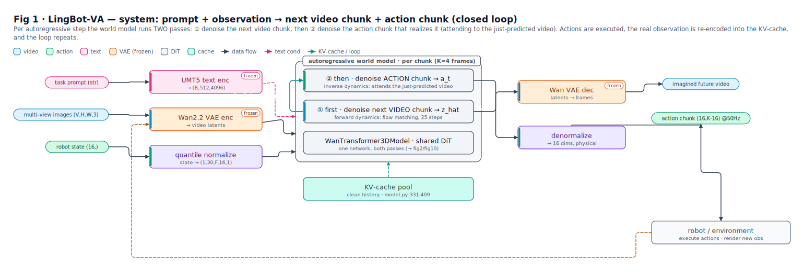
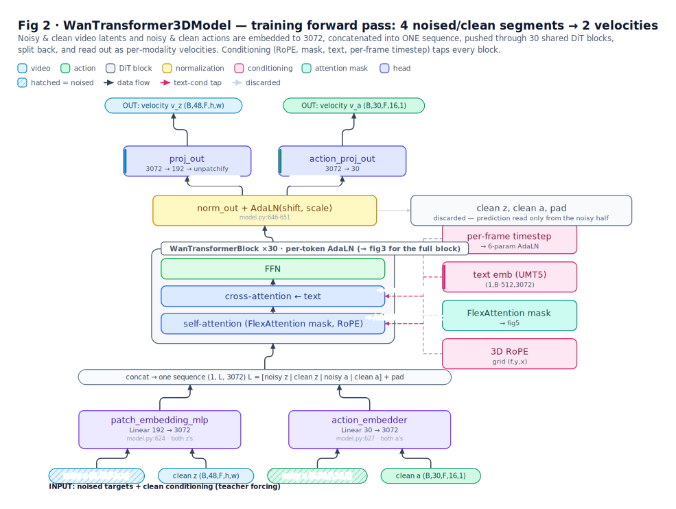
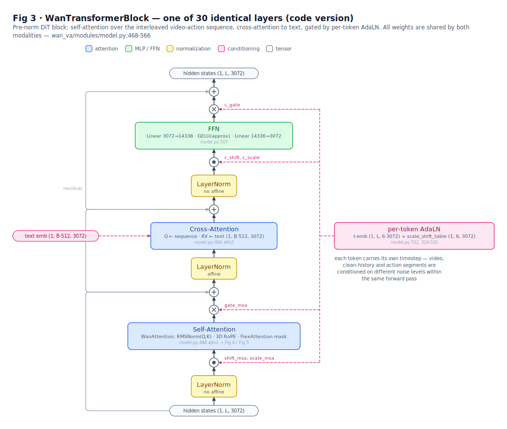
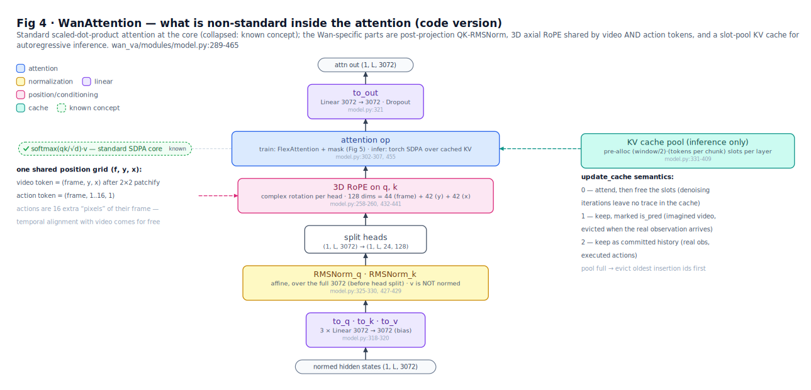
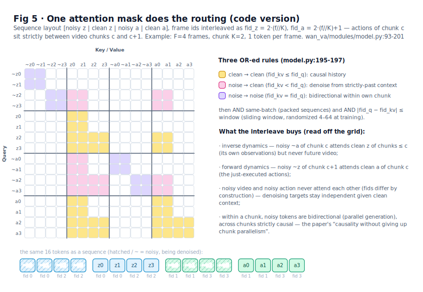
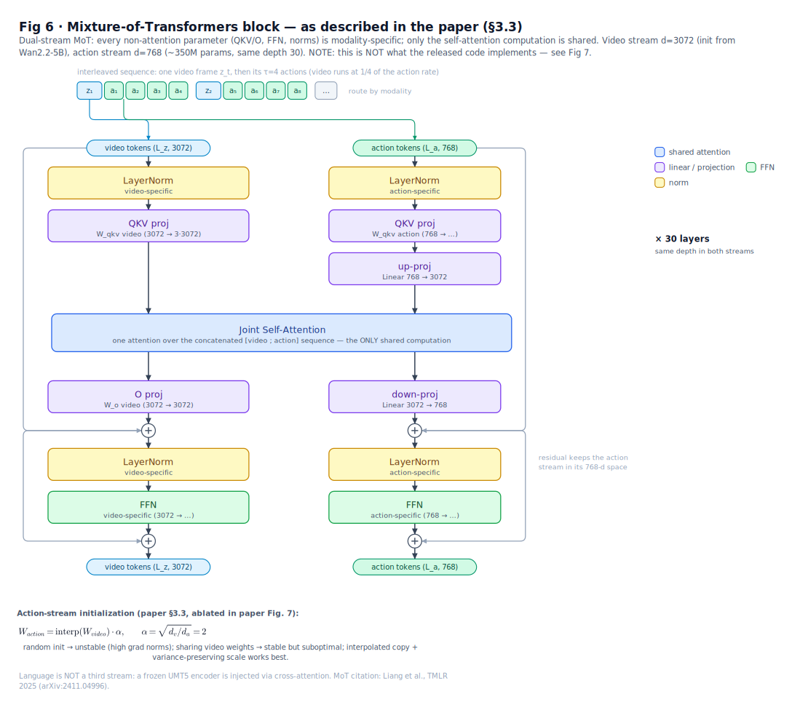
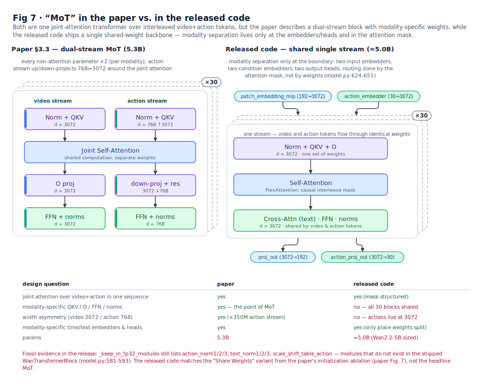
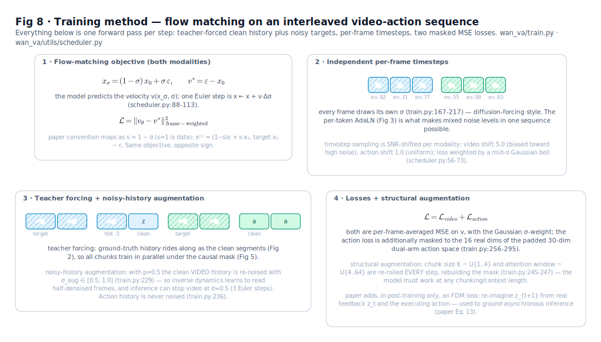
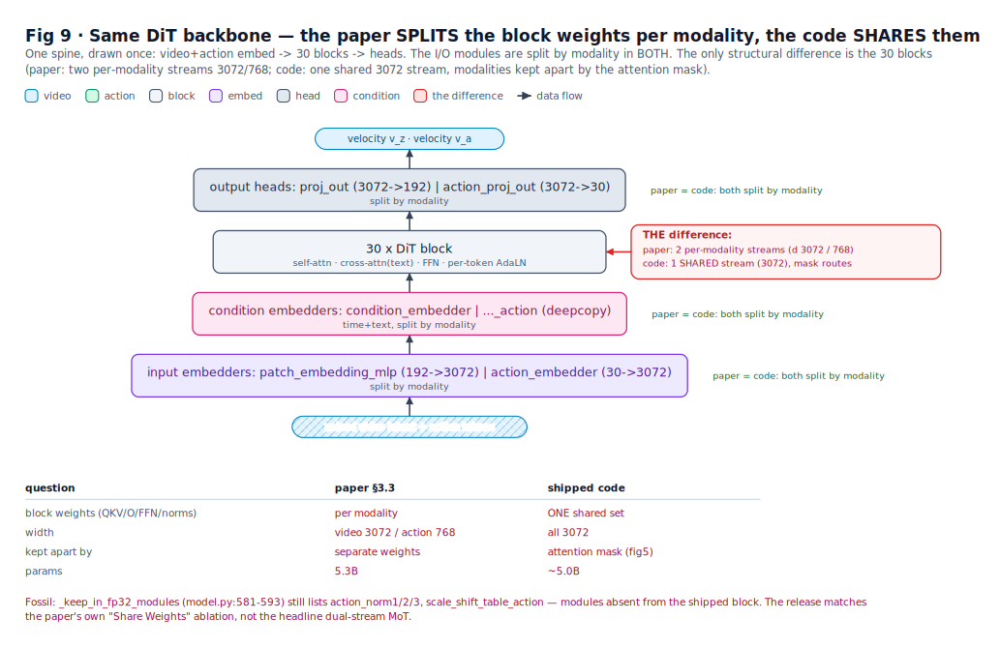

# LingBot-VA — architecture figure set

Subject: [lingbot-va](https://github.com/robbyant/lingbot-va) (Ant Group / Robbyant,
arXiv:2601.21998 *"Causal World Modeling for Robot Control"*). Every "code" claim is
annotated with a `wan_va/` `file:line`; every "paper" claim with its §/page. Scripts:
[`examples/lingbot_va/`](../../examples/lingbot_va/).

> **TL;DR**: LingBot-VA interleaves video latents and robot actions into one causal
> sequence on top of the Wan2.2-5B video DiT, and learns next-chunk video prediction
> (forward dynamics) + action decoding (inverse dynamics) jointly with flow matching.
> **The paper describes a dual-stream MoT (video d=3072 / action d=768); the released
> code implements a single shared-weight stream routed purely by an attention mask** —
> not the same architecture (see fig 7).

| figure | what it shows | source |
|---|---|---|
|  | **fig 1 · system overview** — encoders → AR world model (two denoise passes per chunk) → decode/execute → real observations re-encoded (closed loop) | `wan_va_server.py` |
|  | **fig 2 · training forward pass** — `[noisy z \| clean z \| noisy a \| clean a]` concatenated into ONE sequence through 30 shared blocks, two read-out heads | `model.py:702-798` |
|  | **fig 3 · WanTransformerBlock** — pre-norm DiT block with **per-token AdaLN** (each token carries its own timestep — the diffusion-forcing enabler) | `model.py:468-566` |
|  | **fig 4 · WanAttention internals** — QK-RMSNorm, 3D axial RoPE (44f+42y+42x, actions share the grid), slot-pool KV cache semantics | `model.py:289-465` |
|  | **fig 5 · the attention mask** — three rules do ALL modality/causality routing; interleaved frame-ids slot action chunks between video chunks. Grid cells are computed from the real rules | `model.py:93-201` |
|  | **fig 6 · MoT block as the PAPER describes it** — dual streams with separate QKV/FFN/norms; action tokens up-project 768→3072 for joint attention, return via residual | paper §3.3 |
|  | **fig 7 · paper vs code** — the difference table + fossil evidence (`_keep_in_fp32_modules` still lists `action_norm1/2/3` etc., modules absent from the shipped block); the release matches the paper's "Share Weights" ablation | both |
|  | **fig 8 · training method** — flow matching, independent per-frame timesteps, teacher forcing + noisy-history augmentation (p=0.5 ⇒ video only denoised to s≈0.6 at inference), losses | `train.py` / `scheduler.py` |
|  | **fig 9 · model structure, paper vs repo** — side-by-side of the *module structure*: paper §3.3 dual-stream MoT (per-modality weights, 3072/768) vs the real `model.py` module tree (one shared 3072-d backbone; split only at 2 embedders + 2 condition embedders + 2 heads; mask routing). The structural version of fig 7 | paper §3.3 + `model.py` |

Suggested reading order: fig 1 (where things live) → fig 2 (dataflow) → fig 3 (the
block) → fig 4 (attention details) → fig 5 (the mask as glue) → fig 8 (training) →
fig 6 + 7 + 9 (what the paper says vs what the code does — fig 9 is the module-tree view).

Known internal inconsistencies in the paper (figures use the implementation-side
values): partial-denoise endpoint s=0.5 (§3.3/Alg. 1) vs s=0.6 (p. 10); chunk range
[1,8] (prose example) vs [1,4] (actual training, p. 10).
